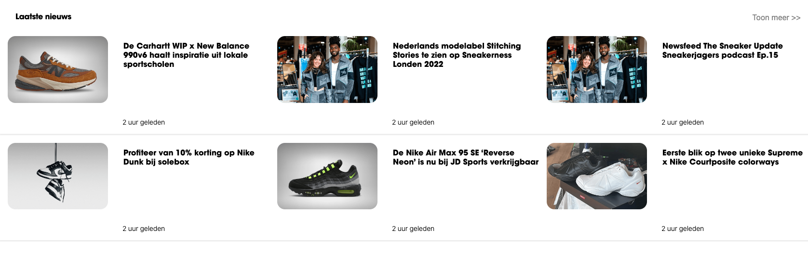

# Procesverslag
Markdown is een simpele manier om HTML te schrijven.  
Markdown cheat cheet: [Hulp bij het schrijven van Markdown](https://github.com/adam-p/markdown-here/wiki/Markdown-Cheatsheet).

Nb. De standaardstructuur en de spartaanse opmaak van de README.md zijn helemaal prima. Het gaat om de inhoud van je procesverslag. Besteedt de tijd voor pracht en praal aan je website.

Nb. Door *open* toe te voegen aan een *details* element kun je deze standaard open zetten. Fijn om dat steeds voor de relevante stuk(ken) te doen.

## Jij

  
uitwerken voor kick-off werkgroep

  ### Auteur:
  Tim Keizer

  #### Je startniveau:
  blauw/rood

  #### Je focus:
  hier je focus (responsive)
 

## Je website

  
uitwerken voor kick-off werkgroep

  ### Je opdracht:
  https://www.sneakerjagers.com/en

  #### Screenshot(s) van de eerste pagina (small screen): 
  home pagina
  

  #### Screenshot(s) van de tweede pagina (small screen):
  detail pagina
  

  
 

## Toegankelijkheidstest 1/2 (week 1)

  
uitwerken na test in 2e werkgroep

  ### Bevindingen
  Lijst met je bevindingen die in de test naar voren kwamen:

## Breakdownschets (week 1)

  
uitwerken na afloop 3e werkgroep

  ### de hele pagina: 
  

## Voortgang 1 (week 2)

  
uitwerken voor 1e voortgang

  ### Stand van zaken
  Ik wist niet goed welke elementen ik moest gebruiken voor bepaalde delen van de website.
  Ik keek teveel naar de code van inspect en niet naar logische oplossingen.

  ### Agenda voor meeting
  samen met je groepje opstellen

  | student 1      | student 2          | student 3    | student 4        |
  | ---            | ---                | ---          | ---              |
  | dit bespreken  | en dit             | en ik dit    | en dan ik dat    |
  | en dat ook nog | dit als er tijd is | nog een punt | dit wil ik zeker |
  | ...            | ...                | ...          | ...              |

  ### Verslag van meeting
  hier na afloop snel de uitkomsten van de meeting vastleggen

  - punt 1: Ik weet nu welke elementen ik moet gebruiken voor delen van de website.

## Voortgang 2 (week 3)

  
uitwerken voor 2e voortgang

  ### Stand van zaken
  Goed op weg alleen flinke problemen gehad met het maken van een responsive hamburger menu.

  ### Agenda voor meeting
  samen met je groepje opstellen

  | student 1      | student 2          | student 3    | student 4        |
  | ---            | ---                | ---          | ---              |
  | dit bespreken  | en dit             | en ik dit    | en dan ik dat    |
  | en dat ook nog | dit als er tijd is | nog een punt | dit wil ik zeker |
  | ...            | ...                | ...          | ...              |

  ### Verslag van meeting
  hier na afloop snel de uitkomsten van de meeting vastleggen

  - punt 1: Het hamburger menu hoefde niet de focus te krijgen volgends de student assistent,
  omdat ik kies voor responsive design.
  - punt 2 Goed kijken welke elementen je moet gebruiken.
  - Duidelijke en betrouwbare bronnen gebruiken.
- ...

## Toegankelijkheidstest 2/2 (week 4)

  
uitwerken na test in 9e werkgroep

  ### Bevindingen
  Lijst met je bevindingen die in de test naar voren kwamen (geef ook aan wat er verbeterd is):

## Voortgang 3 (week 4)

  
uitwerken voor 3e voortgang

  ### Stand van zaken
  hier dit ging goed & dit was lastig (neem ook screenshots op van delen van je website en code)

  ### Agenda voor meeting
  samen met je groepje opstellen

  | student 1      | student 2          | student 3    | student 4        |
  | ---            | ---                | ---          | ---              |
  | dit bespreken  | en dit             | en ik dit    | en dan ik dat    |
  | en dat ook nog | dit als er tijd is | nog een punt | dit wil ik zeker |
  | ...            | ...                | ...          | ...              |

  ### Verslag van meeting
  hier na afloop snel de uitkomsten van de meeting vastleggen

  - punt 1
  - punt 2
  - nog een punt
  - ...

## Eindgesprek (week 5)

  
uitwerken voor eindgesprek

  ### Je uitkomst - karakteristiek screenshots:
  

  ### Dit ging goed/Heb ik geleerd: 
  Korte omschrijving met plaatjes

  Het actief gebruik maken van media queries.

  
  

  ### Dit was lastig/Is niet gelukt:
  Korte omschrijving met plaatjes
  Het maken van de correcte navigatie en deze responsive krijgen met een hamburger menu daarbij heb ik weinig tijd kunnen besteden aan de 2e pagina. op de 2e pagina werkte de normale navigatie ook niet mee.

  Voor en heb ik de footer niet correct kunnen afmaken :C.

  
  
  

## Bronnenlijst

  
continu bijhouden terwijl je werkt

  Nb. Wees specifiek ('css-tricks' als bron is bijv. niet specifiek genoeg). 
  Nb. ChatGpT en andere AI horen er ook bij.
  Nb. Vermeld de bronnen ook in je code.

  1. bron 1: https://css-tricks.com/snippets/css/complete-guide-grid/ / https://css-tricks.com/snippets/css/a-guide-to-flexbox/ / https://css-tricks.com/almanac/properties/p/position/
  2. bron 2
  3. bron 3: chatGpt voor uitleg over bepaalde elementen zoals de mediaqueries, welke elementen waarvoor staan in JS.

